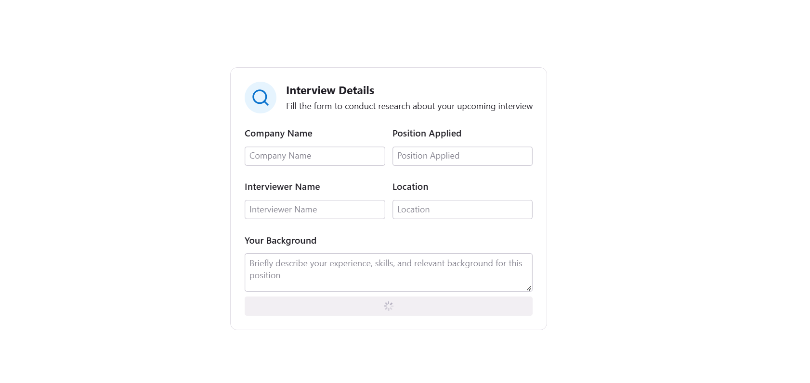
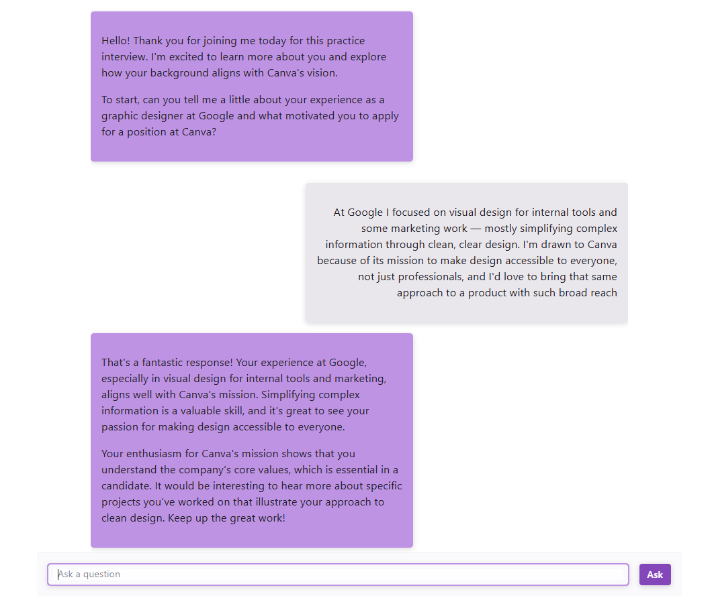

# Interview Bot

A Python web app that helps people prepare for job interviews using AI.

## What it does

Interview Bot is an AI-powered interview practice tool. It uses the OpenAI
API to simulate interview questions and/or feedback, helping users prepare
for real job interviews in an interactive way.

## Why

Practicing for interviews alone is hard, it's tough to know what kinds of
questions to expect or how to improve your answers. This tool gives users
an interactive, AI-driven way to practice and get feedback before the real
thing.

## Features

- AI-generated interview questions and/or answer feedback (via OpenAI)
- Interactive, full-stack web interface (built with Reflex)
- Persistent data storage (SQLModel/SQLAlchemy with Alembic migrations)
- Real-time interaction support (via WebSockets/Socket.IO)

## Tech stack

- **Python**
- **Reflex** — full-stack Python web framework (frontend + backend)
- **OpenAI API** — question generation / interview feedback
- **SQLModel / SQLAlchemy + Alembic** — database ORM and migrations
- **Redis** — caching / session or real-time state
- **Socket.IO** — real-time communication

